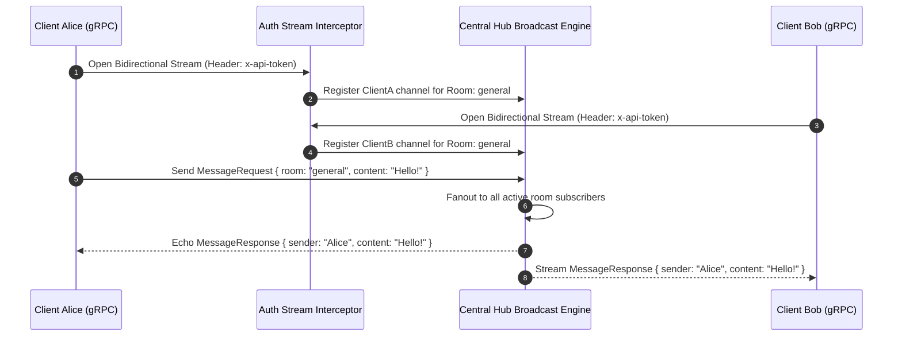

# grpc-stream-hub

> High-throughput **bidirectional gRPC streaming hub** with Protocol Buffers schema, metadata auth interceptors, and fanout pub/sub broadcasting in **Go**.

[](https://golang.org)
[](https://grpc.io)
[](https://github.com/txltedxgod/grpc-stream-hub/actions)
[](https://docker.com)
[](LICENSE)

`#grpc` `#protobuf` `#bidirectional-streaming` `#pubsub` `#golang` `#microservices` `#high-throughput`

---

## 🏛️ Bidirectional Streaming Architecture



---

## Features

- **Full Bidirectional Streaming:** High-efficiency HTTP/2 multiplexed streams via standard gRPC.
- **Topic / Room Isolation:** Central lock-striped hub manages dynamic subscriptions without blocking publishers.
- **Stream Interceptors:** Metadata token validation and request tracing on stream initialization.
- **Slow Consumer Protection:** Non-blocking broadcast drops slow buffers to prevent head-of-line blocking.

## Quick Start

```bash
# 1. Run gRPC Hub Server
go run server/main.go server/hub.go server/interceptor.go -port=50051

# 2. Run Interactive Client
go run client/main.go -server=localhost:50051 -room=general -user=alice
```
